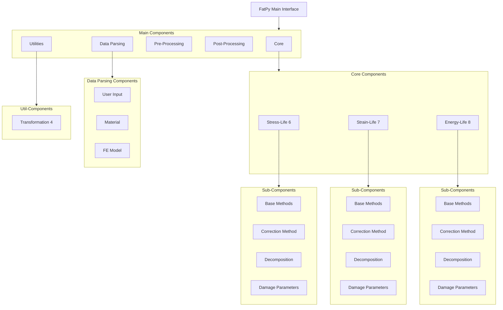

# FatPy Architecture

## Component Diagram

```mermaid
graph TB
    Main[FatPy Main Interface]

      subgraph MainComponents[Main Components]
        direction LR
        Core[Core]
        DataParsing[Data Parsing]
        PreProcessing[Pre-Processing]
        PostProcessing[Post-Processing]
        Utils[Utilities]
      end

      Main --> MainComponents

      subgraph CoreComponents[Core Components]
        direction LR
        StressLife[Stress-Life 6]
        StrainLife[Strain-Life 7]
        EnergyLife[Energy-Life 8]
      end

      Core --> CoreComponents

      subgraph SubComponents1[Sub-Components]
        direction LR
        BaseMethods1[Base Methods]
        CorrectionMethod1[Correction Method]
        Decomposition1[Decomposition]
        DamageParam1[Damage Parameters]
      end

      subgraph SubComponents2[Sub-Components]
        direction LR
        BaseMethods2[Base Methods]
        CorrectionMethod2[Correction Method]
        Decomposition2[Decomposition]
        DamageParam2[Damage Parameters]
      end

      subgraph SubComponents3[Sub-Components]
        direction LR
        BaseMethods3[Base Methods]
        CorrectionMethod3[Correction Method]
        Decomposition3[Decomposition]
        DamageParam3[Damage Parameters]
      end

      StressLife --> SubComponents1
      StrainLife --> SubComponents2
      EnergyLife --> SubComponents3

      subgraph DataParsingComponents[Data Parsing Components]
        direction LR
        UserInput[User Input]
        Material[Material]
        FeModel[FE Model]
      end

      DataParsing --> DataParsingComponents

      subgraph UtilComponents[Util-Components]
        direction LR
        Transformation[Transformation 4]
      end

      Utils --> UtilComponents


```
